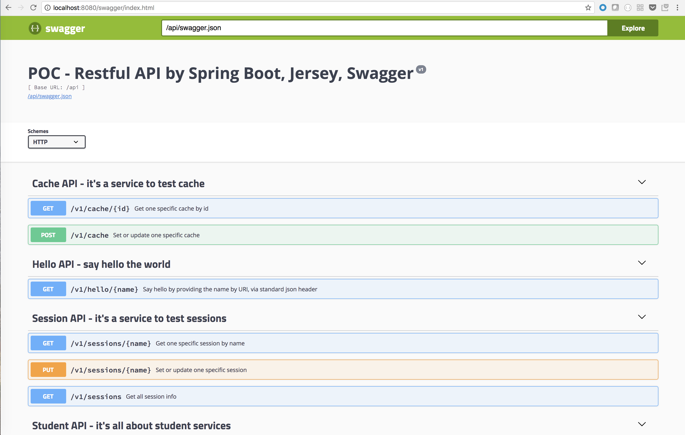

# springboot-jersey-swagger

[](https://travis-ci.org/brightzheng100/springboot-jersey-swagger)

This is a proof-of-concept project to build RESTful web services by integrating below components:
 - [Spring Boot](http://projects.spring.io/spring-boot/) - The foundation of our web app which uses below sub projects
   - org.springframework.boot:spring-boot-starter
   - org.springframework.boot:spring-boot-starter-web
   - org.springframework.boot:spring-boot-starter-actuator
   - org.springframework.boot:spring-boot-starter-jersey
   - org.springframework.boot:spring-boot-starter-jdbc
   - org.springframework.boot:spring-boot-starter-log4j2
 - [Spring Session](https://projects.spring.io/spring-session/) - The abstraction layer for session + distributed cache (e.g. Redis)
 - [Spring Cloud Connector](https://cloud.spring.io/spring-cloud-connectors/) - connecting to services and gaining operating environment awareness in cloud environments
   - org.springframework.cloud:spring-cloud-spring-service-connector
   - org.springframework.cloud:spring-cloud-cloudfoundry-connector
 - [Jersey](https://jersey.java.net/) - The JAX-RS reference implementation for building RESTful web services
 - [Swagger](https://github.com/swagger-api/swagger-ui) - The de-facto API documentation framework
 - [Flyway](https://flywaydb.org/) - Database migrate/upgrade automation

For testing, we use below components:
 - Spring Boot Test Framework (spring-boot-starter-test) with Junit, Hamcrest
 - [Rest Assured](https://github.com/rest-assured/rest-assured)

# Takeaways
 - How To Integrate Spring Boot, Jersey, Swagger, Spring Session, Spring Cloud Connector, and Flyway to build real world JSON-based RESTful web services
 - Unit Test practices for RESTful API testing

# Before You Start It Up

There is a dependency on Redis, as the cache by default, and I don't build to make it an embedded service, so before you start it up, do this:

```
$ curl -OL http://download.redis.io/releases/redis-4.0.8.tar.gz
$ tar xzf redis-4.0.8.tar.gz
$ cd redis-4.0.8
$ make
$ src/redis-server
```
 
# Start It UP

Check out the code and execute below commands:

```
$ mvn package
$ java -Dspring.profiles.active=dev -jar target/springboot-jersey-swagger-1.0.0-SNAPSHOT.jar
```

> Note: activate `dev` profile while running locally.

# Play With the Web Services

```
> curl -X GET http://localhost:8080/api/v1/hello/Bright
{"msg":"Hello Bright - application/json"}

>curl -X GET http://localhost:8080/api/v1/hello/404
{"timestamp":1466473854650,"status":404,"error":"Not Found","message":"Not Found","path":"/api/v1/hello/404"}
```

# Check Out the Swagger UI

Open a browser and key in URL:

```
$ open http://localhost:8080/swagger/index.html
```



Note: we can play around the APIs within the UI.

# Cloud Ready?

It's totally ready to deploy it to cloud, like [Pivotal Web Services](https://run.pivotal.io).
Try it out by using `cf push -f manifest-qa.yml`.
Don't forget to bind MySQL Service and Redis Service to it to make it fully function.

# Blog

[From Code To Online Services: My experiments of DevOps - Development of RESTful Web Services by Spring Boot, Jersey, Swagger](http://bright-zheng.blogspot.com/2016/06/Development-of-RESTful-WebServices-by-SpringBoot-Jersey-Swagger.html)